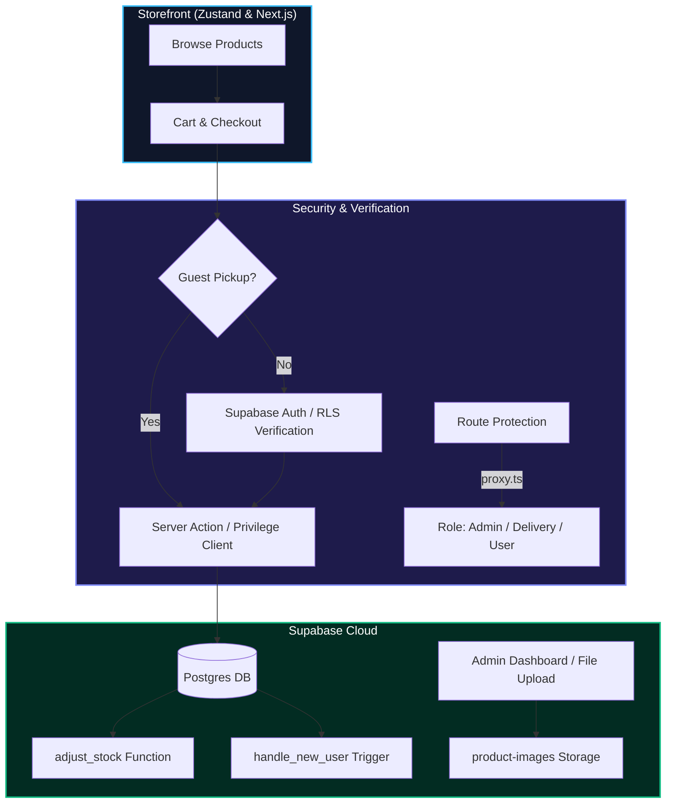

# 🛒 FlopShop — Premium Hostel Shop Management System

[-black?style=for-the-badge&logo=next.js&logoColor=white)](https://nextjs.org)
[](https://www.typescriptlang.org)
[](https://supabase.com)
[](https://tailwindcss.com)
[](https://zustand-demo.pmnd.rs)

A state-of-the-art, full-stack hostel snack shop management system. Designed for seamless operations: students browse and order (pickup or room delivery), delivery partners fulfill assigned room deliveries, and admins manage inventory, categories, purchases, orders, invoicing, and real-time financial reporting.

---

## 🏗️ Architecture Flow



---

## ✨ Key Features

### 🛍️ Customers
- **Intuitive Storefront**: Fast categorical navigation, visual search, and quick-add actions.
- **Detailed Product Modals**: Real-time display of nutrition details, ingredients, and product origin imported directly via OpenFoodFacts integration.
- **Versatile Checkout**: Support for guest-allowed pickup orders and login-required hostel room deliveries.
- **Status Timelines & Invoices**: Interactive status updates and print-ready invoices for order tracking.

### 👑 Administrators (Dark Mode Console)
- **Real-Time Dashboard**: Key performance statistics, 7-day revenue charts (interactive Recharts), and category pie charts.
- **Catalog Management**: Full CRUD operations on products/categories with a responsive, customizable 4:5 image cropper tool.
- **Inventory Control**: Dedicated Purchases module that records supplier restocks and automatically increments stock.
- **Manual Order Creator**: Desktop and tablet-optimized walk-in/offline order system.
- **Financial Analytics**: Multi-tab Reports with Sales, Profit, and Inventory breakdown, including CSV export.
- **Dynamic Settings**: Live settings panel for shop status toggling (Open/Closed), delivery fees, and earning splits.

### 🛵 Delivery Partners
- **Mobile-Responsive Portal**: Dashboard displaying active order assignments.
- **Quick-Action Delivery**: One-tap "Mark Delivered" triggers with instant backend status synchronization.
- **Earnings Tracking**: Real-time summary of accumulated delivery tips and shares.

---

## 📁 Project Directory Tour

```
flopshop/
├── app/                  # Next.js Pages & Route Handlers
│   ├── (store)/          # Customer facing storefront, cart, checkout, orders
│   ├── admin/            # Admin dashboard, products, purchases, sales, settings
│   ├── delivery/         # Delivery partner portal (assignments, delivery controls)
│   └── api/              # Internal APIs (OpenFoodFacts search proxy, profiles, etc.)
├── components/           # Reusable UI Components
│   ├── admin/            # Image adjusters, stats cards, tables, dashboard charts
│   ├── store/            # Product cards, detail modals, cart drawer
│   └── ui/               # Base styled primitives (buttons, inputs, select fields)
├── lib/                  # Application Utilities & Infrastructure
│   ├── hooks/            # Frontend hooks (zustand cart hook, settings hydration)
│   ├── supabase/         # Server and client database connection logic
│   └── utils/            # Shared formatting helpers (currency, time boundaries)
├── scripts/              # Seed scripts and OpenFoodFacts enrichments
└── supabase/             # DB schema definitions and setup SQL scripts
```

---

## 🚀 Getting Started

### 1. Installation & Environment Setup
Clone the repository and install the dependencies:
```bash
npm install
```

Configure your environment variables by renaming `.env.example` to `.env.local` and filling in the Supabase API credentials:
```env
NEXT_PUBLIC_SUPABASE_URL=https://YOUR-PROJECT.supabase.co
NEXT_PUBLIC_SUPABASE_ANON_KEY=your_anon_key
SUPABASE_SERVICE_ROLE_KEY=your_service_role_key
```

### 2. Database Schema Setup
1. Log into your **Supabase Workspace**.
2. Go to the **SQL Editor** and execute the entire SQL script from [`supabase/schema.sql`](file:///Users/vee/Web%20Dev/flopshop/supabase/schema.sql).
3. This script sets up:
   - Tables (`profiles`, `categories`, `products`, `orders`, `order_items`, `purchases`, `settings`)
   - An auto-profile creation trigger for new users
   - RLS security policies
   - Default seeds (categories & base shop settings)
   - The `product-images` storage bucket

### 3. Running Locally
Start the local development server:
```bash
npm run dev
```
Open [http://localhost:3000](http://localhost:3000) to view the storefront, or [http://localhost:3000/admin](http://localhost:3000/admin) to view the admin console.

---

## 🔒 Authentication & Role Configuration

By default, authentication is configured with **Google OAuth**.

### Google OAuth Setup
1. Visit the **Google Cloud Console**, create a project, and setup OAuth credentials for a **Web Application**.
   - **Authorized JavaScript origins**: `http://localhost:3000` (and production URLs).
   - **Authorized redirect URI**: Copy the callback URL provided in the Supabase Auth Settings (e.g. `https://<project-ref>.supabase.co/auth/v1/callback`).
2. Go to **Supabase** → **Authentication** → **Providers** → **Google**, enable the provider, paste your Client ID and Client Secret, and save.
3. Add `http://localhost:3000/**` to the redirect allow-list in **Authentication** → **URL Configuration**.

### Elevating User Roles
All new Google sign-ups are created with a default `user` role. To grant administrator or delivery roles:

1. Sign in to the application once.
2. In the Supabase SQL editor, run:
```sql
-- Grant Admin Privileges
UPDATE profiles SET role = 'admin' WHERE email = 'youremail@gmail.com';

-- Grant Delivery Privileges (from Admin UI or SQL)
UPDATE profiles SET role = 'delivery' WHERE email = 'deliveryperson@gmail.com';
```

---

## 💡 Key Business Logic Rules

* **Aspect Ratio Consistency**: All product images are uploaded and managed at a modern **4:5 aspect ratio**. The custom visual adjuster allows admins to crop, pan, and zoom uploaded images, maintaining layout integrity across storefront and tables.
* **Automatic Stock Deductions**: Product stock is automatically decremented when order status transitions from `pending` to confirmed states. If an order is later `cancelled`, stock levels are automatically restored. Walk-in manual orders bypass approval and deduct stock instantly.
* **Split Delivery Fees**: Delivery earnings are calculated dynamically on every checkout:
  - Default: ₹10 Delivery Fee = ₹8 Delivery Partner Share + ₹2 Shop/Platform Share.
  - Fees are locked into each order row at creation to remain robust against future setting updates.
* **Code Prefixes**: Order codes conform to `ORD-YYMMDD-####` (sequential index per day) and invoices are structured as `INV-YYMMDD-###`.

---

## 🛠️ Tech Stack & Credits

- **Framework**: [Next.js 16 (App Router)](https://nextjs.org/)
- **Styling**: [Tailwind CSS](https://tailwindcss.com/)
- **Database**: [Supabase PostgreSQL](https://supabase.com/)
- **State management**: [Zustand](https://github.com/pmndrs/zustand)
- **Charts**: [Recharts](https://recharts.org/)
- **Product Data**: [OpenFoodFacts API](https://world.openfoodfacts.org/)
