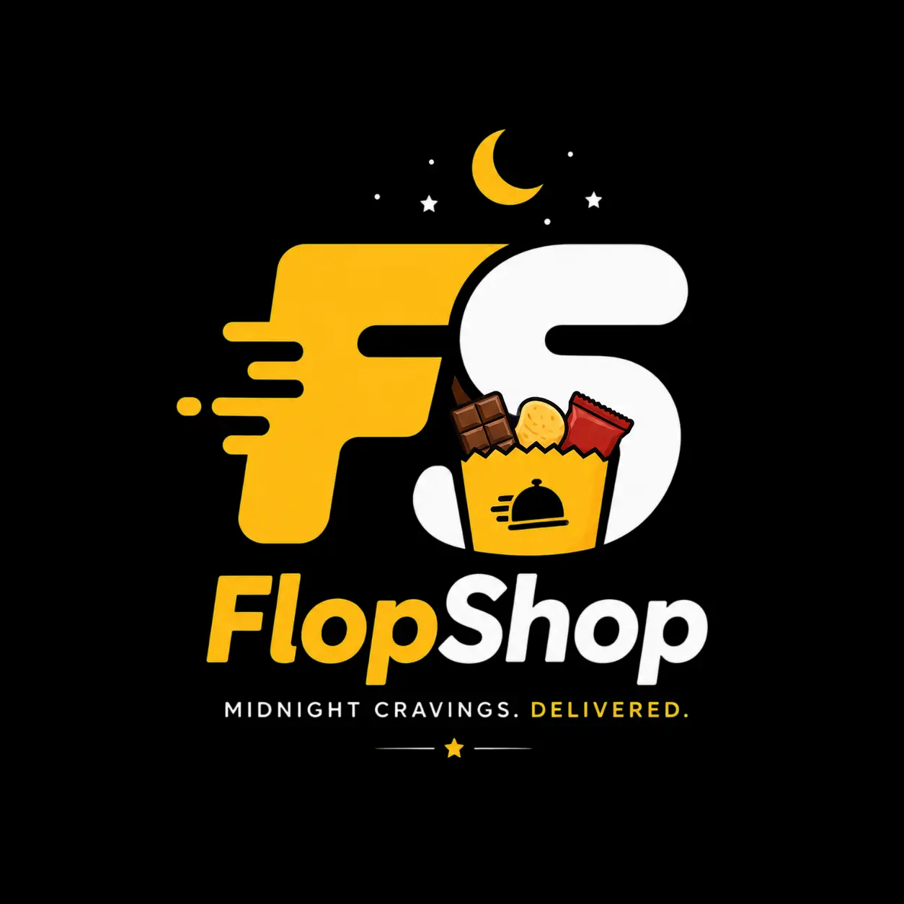
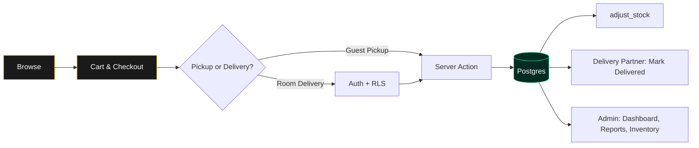

<div align="center">



# FlopShop

### Midnight Cravings. Delivered.

A full-stack hostel snack shop — students order, partners deliver, admins run the show.

<br />

[](https://nextjs.org)
[](https://www.typescriptlang.org)
[](https://supabase.com)
[](https://tailwindcss.com)
[](https://zustand-demo.pmnd.rs)

</div>

---

## Quick Start

```bash
git clone <repo-url> flopshop && cd flopshop
npm install
cp .env.example .env.local      # add your Supabase keys
npm run dev
```

→ Storefront at **[localhost:3000](http://localhost:3000)** · Admin console at **[localhost:3000/admin](http://localhost:3000/admin)**

```env
NEXT_PUBLIC_SUPABASE_URL=https://YOUR-PROJECT.supabase.co
NEXT_PUBLIC_SUPABASE_ANON_KEY=your_anon_key
SUPABASE_SERVICE_ROLE_KEY=your_service_role_key
```

Then open the Supabase **SQL Editor** and run [`supabase/schema.sql`](supabase/schema.sql) once — it provisions every table, the `product-images` storage bucket, RLS policies, the auto-profile trigger, and default seeds.

---

## How It Flows



---

## What's Inside

### 🛍️ For Customers
Fast categorical storefront with visual search and quick-add. Product modals pull live nutrition, ingredients, and origin from **OpenFoodFacts**. Checkout supports guest pickup or login-required room delivery, with interactive status timelines and print-ready invoices.

### 👑 For Admins
Real-time dashboard with 7-day revenue and category charts (Recharts). Full product/category CRUD with a custom **4:5 image cropper**. A Purchases module that auto-increments stock on restock, a walk-in order creator, multi-tab financial reports with CSV export, and a live settings panel for shop status, delivery fees, and earning splits.

### 🛵 For Delivery Partners
Mobile-first portal showing active assignments. One-tap **Mark Delivered** syncs status instantly, with a running tally of accumulated tips and shares.

---

## Project Layout

```
flopshop/
├── app/              # Routes — (store) storefront · admin console · delivery portal · api
├── components/       # UI — admin/ · store/ · ui/ primitives
├── lib/              # hooks/ (zustand cart, settings) · supabase/ clients · utils/
├── scripts/          # Seed + OpenFoodFacts enrichment
└── supabase/         # schema.sql and setup scripts
```

---

## Roles & Auth

Authentication runs on **Google OAuth** via Supabase. Every sign-up starts as a `user`; elevate roles from the SQL editor:

```sql
UPDATE profiles SET role = 'admin'    WHERE email = 'you@gmail.com';
UPDATE profiles SET role = 'delivery' WHERE email = 'partner@gmail.com';
```

<details>
<summary><b>Google OAuth setup</b></summary>

1. In **Google Cloud Console**, create a Web Application OAuth credential.
   - **Authorized origins**: `http://localhost:3000` (plus production URLs)
   - **Redirect URI**: the callback from Supabase Auth Settings, e.g. `https://<project-ref>.supabase.co/auth/v1/callback`
2. In **Supabase → Authentication → Providers → Google**, enable it and paste your Client ID & Secret.
3. Add `http://localhost:3000/**` to **Authentication → URL Configuration**.
</details>

---

## Business Rules

| Rule | Behavior |
| --- | --- |
| **Image ratio** | All product images are normalized to **4:5** via the in-app crop / pan / zoom adjuster. |
| **Stock** | Auto-deducts when an order is confirmed, restores on cancel. Walk-in orders deduct instantly. |
| **Delivery split** | Default ₹10 fee = ₹8 partner + ₹2 shop, locked into each order row at creation. |
| **Codes** | Orders `ORD-YYMMDD-####` · Invoices `INV-YYMMDD-###`, sequential per day. |

---

## Built With

[Next.js 16](https://nextjs.org/) · [TypeScript](https://www.typescriptlang.org/) · [Supabase Postgres](https://supabase.com/) · [Tailwind CSS](https://tailwindcss.com/) · [Zustand](https://github.com/pmndrs/zustand) · [Recharts](https://recharts.org/) · [OpenFoodFacts](https://world.openfoodfacts.org/)

<div align="center">
<br />
<sub>FlopShop — Midnight Cravings. Delivered.</sub>
</div>
